# T.system Architecture — v3
**Version:** 3  
**Dated:** 2026-04-21  
**Prior version:** `architecture-v2-2026-04-21.md`  
**Supersedes:** v2 (for consumer reads)

**Changes from v2:**
- **§3 Scripts:** Added `gen_trade_rec_html.py` — canonical HTML trade-rec report generator (20-section locked format, Chart.js 4.4.0, dark theme); required Step 10 of daily-trade-rec; previously absent from architecture
- **§4 File Location Map:** Updated `report-{date}-trade-rec.html` Notes to reference `gen_trade_rec_html.py` and format lock date 2026-04-21
- No changes to §1–§2, §5–§11 wiring, execution order, skill tables, variable registry, or governance rules

---

## ⚠️ GOVERNANCE — THIS IS THE HEART OF THE OPERATION

1. **This file is IMMUTABLE.** Never edit in place. Never patch. Never append to §Changelog of a sealed version. Once dated and committed, a version is frozen.
2. **All changes ship as a new version file** in `Trade/framework/architecture/` named `architecture-v{N}-{YYYY-MM-DD}.md`. Increment N monotonically.
3. **Every new version MUST include at the top:**
   - `**Prior version:**` → filename of the immediately previous version
   - `**Changes from v{N-1}:**` → bulleted diff listing every addition, modification, removal with section reference
4. **Source of truth for wiring** remains each skill's `Trade/.claude/skills/{skill}/SKILL.md`. When SKILL.md and this file conflict, SKILL.md wins — and a new architecture version must be cut to reconcile.
5. **Do not delete prior versions.** The folder is append-only history.
6. **Consumers read the latest version** — resolve via `ls Trade/framework/architecture/ | sort` and take the highest `v{N}`.

---

**Maintained by:** `methodology-sync` skill — cuts a new version when skill wiring, file paths, or task scheduling changes.  
**Source of truth for wiring:** each skill's `Trade/.claude/skills/{skill}/SKILL.md`.

---

## 1. Execution Order (Mon–Fri, UTC+8)

| Time | Task | Skill / Script | Model | Hard upstream (blocks if absent) | Soft upstream (gap if absent) |
|---|---|---|---|---|---|
| 07:38 | us-close-snapshot | utility task | Haiku | — | Memory.md §2, prior brief/rec |
| 09:00 (4×/day) | slack-ingest | utility task | Haiku | — | Slack API |
| 09:03 | positions-monitor | `positions-monitor` | Haiku | Memory.md §2 | us-close-snapshot, slack-digest |
| 18:00 | cloud-market-brief-6pm | `market-brief` (cloud) | Sonnet | — | Grade B context only |
| 18:30 | cloud-news-events-630pm | `news-events` (cloud) | Haiku | — | Grade B context only |
| 19:00 | cloud-trade-rec-7pm | `daily-trade-rec` (cloud) | Opus | — | Grade B context only |
| 19:50 | preflight-audit-data | `compute_audit_additions.py` | Haiku | FF5 data, Yahoo prices | `.data-cache/` fallback |
| 19:55 | preflight-meta-additions | `compute_meta_additions.py` | Haiku | Yahoo prices | `.data-cache/` fallback |
| 20:08 | daily-market-brief-8pm | `market-brief` | Sonnet | audit-data-staging | meta-staging, slack-digest, catalysts-cache |
| 20:10 | news-events-daily | `news-events` | Haiku | — | Memory.md §2/§6 |
| 20:30 | trade-rec-daily | `daily-trade-rec` | Opus | market-brief-{today}.md | news, audit-staging, meta-staging |
| 22:00 | pipeline-recovery-daily | `pipeline-recovery` | Haiku | .pipeline-health.json | all upstream dated outputs |
| Event-driven | trade-update | `trade-update` | Sonnet | Memory.md, Trade-Execution-Protocol.md | SignalLedger |

**Weekly (Sun 18:00):** `signal-review` (Sonnet) + `weekly-regime-signal-review` (Sonnet) + `workspace-tidy` (Haiku)  
**Quarterly (2026-07-01):** `quarterly-methodology-review` (Opus)  
**Semi-annual (2026-10-01):** `system-review` (Opus)  
**Semi-annual (2026-10-17):** `literature-review` (Opus)  
**One-time (2026-10-14):** `methodology-audit-6mo-review` — audit-addition demote/promote gate for V026/V027/V028

---

## 2. Key Documents

All under `Trade/framework/` unless noted.

| Document | Path | Authority over | Loaded by |
|---|---|---|---|
| Methodology Prompt | `framework/Methodology Prompt.md` | 8-step framework, Top-33 variables (A/B/C grades), S/T/C/R scoring rules, Overlay Gate | market-brief, daily-trade-rec, signal-review, quarterly-review, methodology-sync |
| Risk Rules | `framework/Risk Rules.md` | Pre-entry checklist (7 gates), sizing, stops, heat limits, drawdown breakers | daily-trade-rec, trade-update, positions-monitor |
| Memory | `framework/Memory.md` | §1 Universe · §2 Open Positions · §5 Watchlist · §6 Catalysts · §7 Closed Trades | All skills |
| memory-lessons | `framework/memory-lessons.md` | Cross-session condensed lessons (~60 days) | signal-review, quarterly-review, literature-review; appended by brief, rec, trade-update |
| Data Sources | `framework/Data Sources.md` | Variable→source map, 4-tier retrieval strategy, staleness classification | market-brief, preflight scripts |
| Trade Execution Protocol | `framework/Trade-Execution-Protocol.md` | 4-layer sync procedure for execution events | trade-update (binding) |
| Excel Sync Protocol | `framework/Excel-Sync-Protocol.md` | Column mappings, append-only rules, SignalLedger dedup | market-brief, daily-trade-rec, signal-review, trade-update |
| Pipeline Recovery Protocol | `framework/Pipeline-Recovery-Protocol.md` | Phase A triage / Phase B recovery runbook | pipeline-recovery |
| Data Retrieval Fallback | `framework/Data-Retrieval-Fallback-Framework.md` | Tier 1→4 cascade, staleness classification | data_retrieval_engine.py |
| Variable Discovery Protocol | `framework/Variable-Discovery-Protocol.md` | Candidate intake, screening criteria, VariableRegistry tiers | literature-review |
| Retention Policy | `framework/Retention Policy.md` | File tiering, archival rules | workspace-tidy only |
| Traditional Research Core | `framework/Trad core.md` | Evidence base for traditional assets | quarterly-review, literature-review only |
| Crypto Research Core | `framework/Coin core.md` | Evidence base for crypto assets | quarterly-review, literature-review only |
| BNMA Meta-Analysis | `Trade/bnma/meta-analysis/BNMA-meta-analysis-2026-04-18.md` | DEPLOY/WATCH/EXCLUDE verdicts, A→B grade downgrades V001/V004/V006/V007/V008 | quarterly-review, literature-review, methodology-audit only |
| PL-NMA Meta-Analysis | `Trade/bnma/meta-analysis/PL-NMA-meta-analysis-2026-04-18.md` | PL-NMA 54-variable ranking (θ, P(top-k), pairwise dominance) | quarterly-review, literature-review, methodology-audit only |
| News Events Taxonomy | `Trade/news-events/README.md` | 12-category taxonomy, 3-tier source hierarchy, 10-rule noise filter, political-comm filter | news-events skill |
| Master Data Log | `Trade/master-data-log.xlsx` | 10 sheets: SignalLedger, PerformanceStats, RegimeHistory, DailyVariables, AuditAdditionLog, DataQuality, VariableRegistry, MethodologyNotes, CatalystLog, README | 7+ skills read or write |
| Evidence Grade Rules | `Trade/.claude/rules/evidence-grades.md` | A/B/C grading discipline, fail-loud on MISSING Grade A, stock-to-flow prohibition | All analysis skills (auto-loaded via .claude/rules/) |
| Risk Rules Summary | `Trade/.claude/rules/risk-rules-summary.md` | Quick-ref pre-entry checklist (6 gates), sizing, heat limits, drawdown breakers | All analysis skills (auto-loaded via .claude/rules/) |
| Project CLAUDE.md | `Trade/.claude/CLAUDE.md` | Asset universe (fixed), memory protocol, pipeline file conventions, 2026-04-14 audit additions | Every session in Trade/ |
| Global CLAUDE.md | `~/.claude/CLAUDE.md` | Skill-editing workflow — full folder ZIP (folder as root) + present_files + 3-line handoff; never diffs, never Settings-only edits | Every session globally |

---

## 3. Scripts

All under `Trade/scripts/`.

| Script | Purpose | Upstream | Downstream |
|---|---|---|---|
| `compute_audit_additions.py` | Compute V026 ResidMom, V027 InterCap, V028 BasisMom | FF5 (Kenneth French), NY Fed, Yahoo Finance | `audit-data-staging-{date}.md` |
| `compute_meta_additions.py` | Compute V029 BAB, V030 DealerGamma, V031 GP/A, V032 CEI, Overlay Gate | Yahoo Finance, `.data-cache/` | `meta-additions-staging-{date}.md` |
| `gen_trade_rec_html.py` | Canonical HTML trade-rec report generator — 20-section locked format, Chart.js 4.4.0, dark theme CSS variables; populate `PER-RUN DATA` block per date then run | `trade-rec-{date}.md` + per-run data variables in script header | `report-{date}-trade-rec.html`; invoked by daily-trade-rec Step 10 (required) |
| `preflight_health_check.py` | Source ping + cache coverage check | External APIs | `.pipeline-health.json` |
| `data_retrieval_engine.py` | 4-tier data retrieval with staleness enforcement | External APIs / `.data-cache/` | Variable readings for market-brief |
| `cache_manager.py` | Read/write `.data-cache/` | `.data-cache/` | All retrieval consumers |
| `catalysts_cache.py` | Read/write `.catalysts-cache/*.json` | news-events output | market-brief, daily-trade-rec |
| `pipeline_status.py` | Read/write `.pipeline-status.json` | Pipeline state | pipeline-recovery, positions-monitor |
| `fetch_ff5_from_french_library.py` | Download FF5 factor returns | Kenneth French data library | compute_audit_additions.py |
| `pack_daily.py` | Pack each skill output into `daily-{date}.md` (§A–§H, §W, §S) | All dated output files | `{date}/daily-{date}.md` |
| `run-us-close-snapshot.ps1` | PowerShell wrapper for US close snapshot task | Yahoo Finance, CoinGecko | `us-close-snapshot-{date}.md` |

---

## 4. File Location Map

### Dated outputs (all under `Trade/{YYYY-MM-DD}/`)

| File | Produced by | Read by | Notes |
|---|---|---|---|
| `audit-data-staging-{date}.md` | preflight-audit-data | market-brief (hard-stop), daily-trade-rec | Fallback: root-level legacy pre-2026-04-19 |
| `meta-additions-staging-{date}.md` | preflight-meta-additions | market-brief (Overlay Gate), daily-trade-rec | No fallback — MISSING blocks V029–V032 + Overlay Gate |
| `slack-digest-{date}-{HHMM}.md` | slack-ingest (4×/day) | market-brief, positions-monitor | Soft dep; positions-monitor auto-invokes slack-ingest if absent |
| `us-close-snapshot-{date}.md` | us-close-snapshot | positions-monitor, daily-trade-rec | Used for intraday fill pricing |
| `news-{date}.md` | news-events | daily-trade-rec (C-leg), positions-monitor (F5) | Produced ~20:10 UTC+8 |
| `market-brief-{date}.md` | market-brief | daily-trade-rec (hard-stop if absent), positions-monitor | Stale if >36h: STALE label; ≥36h blocks new entries |
| `trade-rec-{date}.md` | daily-trade-rec | pipeline-recovery (status check), signal-review | Never re-run after decision window passes |
| `report-{date}-trade-rec.html` | daily-trade-rec → `gen_trade_rec_html.py` | Human review only | Via `gen_trade_rec_html.py`; format locked 2026-04-21; 20-section canonical; do not write manually. Permanent audit trail, not packed into daily. |
| `positions-monitor-{date}.md` | positions-monitor | Human review | Written only if ≥1 flag fires (silent-when-OK) |
| `pipeline-recovery-{date}.md` | pipeline-recovery | Human review | Written only if Phase B recovery fires |
| `weekly-review-{date}.md` | weekly-regime-signal-review | signal-review, daily-trade-rec (latest glob) | Sunday only |
| `signal-review-{date}.md` | signal-review | quarterly-methodology-review, literature-review | Sunday only |
| `report-{date}-signal-review.html` | signal-review | Human review | Permanent, not packed |
| `quarterly-methodology-review-{date}.md` | quarterly-methodology-review | literature-review, system-review | Quarterly, permanent |
| `literature-review-{date}[-scope].md` | literature-review | quarterly-methodology-review | Semi-annual; `-scope` suffix for limited runs |
| `system-review-{date}.md` + `.html` | system-review | methodology-sync | Semi-annual, permanent |
| `daily-{date}.md` | pack_daily.py (§A–§H, §W, §S) | Human convenience view | Not source-of-truth; skills read per-routine files directly |

### Pipeline state (under `Trade/pipeline/`)

| File | Written by | Read by |
|---|---|---|
| `.pipeline-health.json` | preflight_health_check.py | pipeline-recovery (Phase A), market-brief |
| `.pipeline-status.json` | pipeline-recovery, positions-monitor, pipeline_status.py | pipeline-recovery, positions-monitor, daily-trade-rec |
| `audit-data-missing-tracker.md` | pipeline-recovery (append-only) | pipeline-recovery (streak detection, ≥2 → warning, ≥3 → CRITICAL) |
| `.catalysts-cache/catalysts-cache-{date}.json` | catalysts_cache.py (via news-events) | market-brief (§5), daily-trade-rec (C-leg) |
| `pipeline-dependency-graph.mermaid` | Manual / system-review | Human reference — **superseded by this file** |
| `routine-output-map.md` | Manual (2026-04-19) | Human reference — **superseded by this file** |
| `grade-a-gaps.md` | pipeline-recovery | Human reference, pipeline monitoring |

### Persistent caches

| Path | Contents | Staleness rule |
|---|---|---|
| `Trade/.data-cache/` | 80 variable JSON files + Tier-2 CSVs | Per `framework/Data Sources.md` and `Data-Retrieval-Fallback-Framework.md` |
| `Trade/.auto-memory/` | CRITICAL flag escalations from positions-monitor (F2, F8) | Written by positions-monitor, read by next session |

### Skills

All under `Trade/.claude/skills/{skill-name}/SKILL.md`.

| Skill | Model | Cadence |
|---|---|---|
| `market-brief` | Sonnet | Daily Mon–Fri 20:08 UTC+8 |
| `news-events` | Haiku | Daily Mon–Fri 20:10 UTC+8 |
| `daily-trade-rec` | Opus | Daily Mon–Fri 20:30 UTC+8 |
| `positions-monitor` | Haiku | Daily Mon–Fri 09:03 UTC+8 |
| `trade-update` | Sonnet | Event-driven only |
| `pipeline-recovery` | Haiku | Daily 22:00 UTC+8 |
| `signal-review` | Sonnet (Opus) | Weekly Sun 18:00 UTC+8 |
| `quarterly-methodology-review` | Opus | Quarterly (next: 2026-07-01) |
| `literature-review` | Opus | Semi-annual (next: 2026-10-17) |
| `system-review` | Opus | Semi-annual (next: 2026-10-01) |
| `methodology-sync` | Sonnet | On-demand (after Methodology Prompt changes) |
| `pipeline-smoketest` | — | On-demand diagnostic (read-only) |
| `asset-universe-update` | — | On-demand (universe changes only) |

---

## 5. Skill Upstream / Downstream Detail

### `news-events`
| Direction | File | Path |
|---|---|---|
| ← reads | Memory (positions, catalysts) | `Trade/framework/Memory.md` §2, §6 |
| ← reads | News taxonomy | `Trade/news-events/README.md` |
| ← reads | Prior day's news | `Trade/{YYYY-MM-DD}/news-{YYYY-MM-DD}.md` |
| → writes | News file | `Trade/{YYYY-MM-DD}/news-{YYYY-MM-DD}.md` |
| → writes | Catalysts cache | `Trade/pipeline/.catalysts-cache/catalysts-cache-{YYYY-MM-DD}.json` |
| → updates | Memory §6 | `Trade/framework/Memory.md` |
| → appends | memory-lessons | `Trade/framework/memory-lessons.md` |

### `market-brief`
| Direction | File | Path |
|---|---|---|
| ← reads | Methodology Prompt | `Trade/framework/Methodology Prompt.md` |
| ← reads | Risk Rules | `Trade/framework/Risk Rules.md` |
| ← reads | Memory | `Trade/framework/Memory.md` §2, §5, §6 |
| ← reads | Data Sources | `Trade/framework/Data Sources.md` |
| ← reads | Slack digest | `Trade/{YYYY-MM-DD}/slack-digest-{YYYY-MM-DD}-{HHMM}.md` |
| ← reads | Audit staging **(hard-stop)** | `Trade/{YYYY-MM-DD}/audit-data-staging-{YYYY-MM-DD}.md` |
| ← reads | Meta staging | `Trade/{YYYY-MM-DD}/meta-additions-staging-{YYYY-MM-DD}.md` |
| ← reads | Catalysts cache | `Trade/pipeline/.catalysts-cache/catalysts-cache-{YYYY-MM-DD}.json` |
| ← reads | RegimeHistory, DailyVariables | `Trade/master-data-log.xlsx` |
| → writes | Market brief | `Trade/{YYYY-MM-DD}/market-brief-{YYYY-MM-DD}.md` |
| → updates | Memory §5, §6 | `Trade/framework/Memory.md` |
| → appends | memory-lessons | `Trade/framework/memory-lessons.md` |
| → syncs | DailyVariables, RegimeHistory, DataQuality, CatalystLog | `Trade/master-data-log.xlsx` |

### `daily-trade-rec`
| Direction | File | Path |
|---|---|---|
| ← reads | Market brief **(hard-stop if absent)** | `Trade/{YYYY-MM-DD}/market-brief-{YYYY-MM-DD}.md` |
| ← reads | News file | `Trade/{YYYY-MM-DD}/news-{YYYY-MM-DD}.md` |
| ← reads | Audit staging | `Trade/{YYYY-MM-DD}/audit-data-staging-{YYYY-MM-DD}.md` |
| ← reads | Meta staging | `Trade/{YYYY-MM-DD}/meta-additions-staging-{YYYY-MM-DD}.md` |
| ← reads | Methodology Prompt | `Trade/framework/Methodology Prompt.md` |
| ← reads | Risk Rules | `Trade/framework/Risk Rules.md` |
| ← reads | Memory | `Trade/framework/Memory.md` §2, §5 |
| ← reads | Pipeline status | `Trade/pipeline/.pipeline-status.json` |
| ← reads | SignalLedger (dedup) | `Trade/master-data-log.xlsx` |
| → writes | Trade rec | `Trade/{YYYY-MM-DD}/trade-rec-{YYYY-MM-DD}.md` |
| → writes | HTML report | `Trade/{YYYY-MM-DD}/report-{YYYY-MM-DD}-trade-rec.html` |
| → appends | SignalLedger | `Trade/master-data-log.xlsx` |
| → appends | AuditAdditionLog | `Trade/master-data-log.xlsx` |
| → updates | CatalystLog | `Trade/master-data-log.xlsx` |
| → updates | Memory §2, §5 | `Trade/framework/Memory.md` |
| → appends | memory-lessons | `Trade/framework/memory-lessons.md` |

### `trade-update` (event-driven)
| Direction | File | Path |
|---|---|---|
| ← reads | Trade Execution Protocol **(binding)** | `Trade/framework/Trade-Execution-Protocol.md` |
| ← reads | Memory | `Trade/framework/Memory.md` §2, §5, §7 |
| ← reads | SignalLedger | `Trade/master-data-log.xlsx` |
| → updates | Memory §2 (positions, heat) | `Trade/framework/Memory.md` |
| → appends | Memory §7 (closed trades) | `Trade/framework/Memory.md` |
| → syncs | SignalLedger | `Trade/master-data-log.xlsx` |
| → appends | memory-lessons | `Trade/framework/memory-lessons.md` |
| → posts | [POSITION-STATE] | Slack `#trading-scheduled-updates` |

### `positions-monitor`
| Direction | File | Path |
|---|---|---|
| ← reads | Memory | `Trade/framework/Memory.md` §2, §7 |
| ← reads | US close snapshot | `Trade/{YYYY-MM-DD}/us-close-snapshot-{YYYY-MM-DD}.md` |
| ← reads | Slack digest | `Trade/{YYYY-MM-DD}/slack-digest-{YYYY-MM-DD}-{HHMM}.md` |
| ← reads | Pipeline status | `Trade/pipeline/.pipeline-status.json` |
| → writes | Positions monitor (if flags) | `Trade/{YYYY-MM-DD}/positions-monitor-{YYYY-MM-DD}.md` |
| → updates | Pipeline status | `Trade/pipeline/.pipeline-status.json` |
| → writes | Auto-memory (F2, F8 CRITICAL only) | `Trade/.auto-memory/` |

### `pipeline-recovery`
| Direction | File | Path |
|---|---|---|
| ← reads | Pipeline health | `Trade/pipeline/.pipeline-health.json` |
| ← reads | Audit missing tracker | `Trade/pipeline/audit-data-missing-tracker.md` |
| ← reads | All upstream dated outputs | `Trade/{YYYY-MM-DD}/` |
| ← reads | Excel (read-only in Phase B) | `Trade/master-data-log.xlsx` |
| → updates | Pipeline status | `Trade/pipeline/.pipeline-status.json` |
| → appends | Audit missing tracker | `Trade/pipeline/audit-data-missing-tracker.md` |
| → writes | Recovery report (if Phase B) | `Trade/{YYYY-MM-DD}/pipeline-recovery-{YYYY-MM-DD}.md` |
| → writes | System Alert (≥3 consecutive MISSING) | `Trade/framework/Memory.md` |

### `signal-review`
| Direction | File | Path |
|---|---|---|
| ← reads | SignalLedger, PerformanceStats, RegimeHistory, AuditAdditionLog | `Trade/master-data-log.xlsx` |
| ← reads | Memory | `Trade/framework/Memory.md` §2, §5 |
| ← reads | memory-lessons | `Trade/framework/memory-lessons.md` |
| ← reads | Methodology Prompt | `Trade/framework/Methodology Prompt.md` |
| ← reads | Prior signal-reviews | `Trade/{YYYY-MM-DD}/signal-review-{YYYY-MM-DD}.md` |
| → writes | Signal review | `Trade/{YYYY-MM-DD}/signal-review-{YYYY-MM-DD}.md` |
| → updates | PerformanceStats (13 dimensions), VariableRegistry | `Trade/master-data-log.xlsx` |
| → appends | memory-lessons | `Trade/framework/memory-lessons.md` |

### `quarterly-methodology-review`
| Direction | File | Path |
|---|---|---|
| ← reads | SignalLedger, PerformanceStats, RegimeHistory, AuditAdditionLog, VariableRegistry | `Trade/master-data-log.xlsx` |
| ← reads | Methodology Prompt, Risk Rules, Data Sources | `Trade/framework/` |
| ← reads | Trad core, Coin core | `Trade/framework/Trad core.md`, `Trade/framework/Coin core.md` |
| ← reads | memory-lessons, Memory §9 | `Trade/framework/` |
| ← reads | All signal-reviews, prior quarterly-reviews | `Trade/{YYYY-MM-DD}/` |
| → writes | Quarterly review | `Trade/{YYYY-MM-DD}/quarterly-methodology-review-{YYYY-MM-DD}.md` |
| → updates | VariableRegistry | `Trade/master-data-log.xlsx` |

### `literature-review`
| Direction | File | Path |
|---|---|---|
| ← reads | Methodology Prompt, Trad core, Coin core, Data Sources | `Trade/framework/` |
| ← reads | Variable Discovery Protocol | `Trade/framework/Variable-Discovery-Protocol.md` |
| ← reads | Memory §9, memory-lessons | `Trade/framework/` |
| ← reads | RegimeHistory, AuditAdditionLog, VariableRegistry | `Trade/master-data-log.xlsx` |
| ← reads | Prior literature-reviews, signal-reviews, quarterly-reviews | `Trade/{YYYY-MM-DD}/` |
| → writes | Literature review | `Trade/{YYYY-MM-DD}/literature-review-{YYYY-MM-DD}[-scope].md` |
| → updates | VariableRegistry | `Trade/master-data-log.xlsx` |

### `system-review`
| Direction | File | Path |
|---|---|---|
| ← reads | All SKILL.md files | `Trade/.claude/skills/*/SKILL.md` |
| ← reads | All scheduled tasks | via `mcp__scheduled-tasks__list_scheduled_tasks` |
| ← reads | Retention Policy | `Trade/framework/Retention Policy.md` |
| ← reads | Memory, memory-lessons | `Trade/framework/` |
| → writes | System review | `Trade/{YYYY-MM-DD}/system-review-{YYYY-MM-DD}.md` + `.html` |
| → produces | Patch proposals | `Trade/{YYYY-MM-DD}/system-review-patches-{YYYY-MM-DD}.md` |

### `asset-universe-update` (on-demand)
| Direction | File | Path |
|---|---|---|
| ← reads | Project CLAUDE.md (current universe) | `Trade/.claude/CLAUDE.md` |
| ← reads | All SKILL.md files | `Trade/.claude/skills/*/SKILL.md` |
| ← reads | Framework docs referencing universe | `Trade/framework/` |
| → patches | CLAUDE.md, affected SKILL.md, framework files, scheduled-task definitions | Multi-file |

### `pipeline-smoketest` (on-demand, read-only)
| Direction | File | Path |
|---|---|---|
| ← reads | Scheduled task registry | via `mcp__scheduled-tasks__list_scheduled_tasks` |
| ← reads | All SKILL.md files | `Trade/.claude/skills/*/SKILL.md` |
| ← reads | All upstream/downstream file paths | `Trade/**/*` |
| → writes | Single health report (on-demand) | stdout / ephemeral |

### `methodology-sync`
| Direction | File | Path |
|---|---|---|
| ← reads | Methodology Prompt **(source of truth)** | `Trade/framework/Methodology Prompt.md` |
| ← reads | Risk Rules | `Trade/framework/Risk Rules.md` |
| ← reads | All SKILL.md files | `Trade/.claude/skills/*/SKILL.md` |
| ← reads | All scheduled task definitions | via `mcp__scheduled-tasks__list_scheduled_tasks` |
| → writes | Sync report | `Trade/{YYYY-MM-DD}/methodology-sync-{YYYY-MM-DD}.md` |
| → patches | Stale SKILL.md files (CRITICAL urgency, with Gerald sign-off) | `Trade/.claude/skills/*/SKILL.md` |
| → updates | **This file** when wiring changes | `Trade/framework/architecture/` |

---

## 6. Full Dependency Graph

```mermaid
graph TD
    %% ─── EXTERNAL DATA ───
    FF5[("Kenneth French\nFF5 Library")]
    NYFed[("NY Fed\nPrimary Dealer Stats")]
    Yahoo[("Yahoo Finance")]
    CoinGecko[("CoinGecko")]
    Barchart[("Barchart\nCommodity Data")]
    Slack[("Slack\n#trading-scheduled-updates")]

    %% ─── SCRIPTS ───
    S1["compute_audit_additions.py\nV026 ResidMom · V027 InterCap · V028 BasisMom"]
    S2["compute_meta_additions.py\nV029 BAB · V030 DealerGamma · V031 GP/A · V032 CEI · Overlay Gate"]
    S3["preflight_health_check.py"]
    S4["data_retrieval_engine.py\n4-tier retrieval"]
    S5["catalysts_cache.py"]

    %% ─── STAGING / TRANSIENT FILES ───
    AuditStaging["audit-data-staging-{date}.md\nTrade/{date}/"]
    MetaStaging["meta-additions-staging-{date}.md\nTrade/{date}/"]
    SlackDigest["slack-digest-{date}-{HHMM}.md\nTrade/{date}/"]
    CatalystsCache["catalysts-cache-{date}.json\nTrade/pipeline/.catalysts-cache/"]
    USClose["us-close-snapshot-{date}.md\nTrade/{date}/"]

    %% ─── FRAMEWORK DOCUMENTS ───
    MethodPrompt["Methodology Prompt.md\nTrade/framework/"]
    RiskRules["Risk Rules.md\nTrade/framework/"]
    Memory["Memory.md\nTrade/framework/\n§2 Positions · §5 Watchlist · §6 Catalysts · §7 Closed"]
    MemLessons["memory-lessons.md\nTrade/framework/"]
    DataSources["Data Sources.md\nTrade/framework/"]
    ExecProto["Trade-Execution-Protocol.md\nTrade/framework/"]
    TradCore["Trad core.md\nTrade/framework/"]
    CoinCore["Coin core.md\nTrade/framework/"]
    VarDisc["Variable-Discovery-Protocol.md\nTrade/framework/"]

    %% ─── EXCEL ───
    Excel[("master-data-log.xlsx\nTrade/\nSignalLedger · PerformanceStats · RegimeHistory\nDailyVariables · AuditAdditionLog · DataQuality\nVariableRegistry · MethodologyNotes · CatalystLog")]

    %% ─── PIPELINE STATE ───
    PipeHealth["pipeline-health.json\nTrade/pipeline/"]
    PipeStatus["pipeline-status.json\nTrade/pipeline/"]
    AuditTracker["audit-data-missing-tracker.md\nTrade/pipeline/"]

    %% ─── DAILY SKILLS ───
    NE["news-events · Haiku\nTrade/.claude/skills/news-events/"]
    MB["market-brief · Sonnet\nTrade/.claude/skills/market-brief/"]
    TR["daily-trade-rec · Opus\nTrade/.claude/skills/daily-trade-rec/"]
    PM["positions-monitor · Haiku\nTrade/.claude/skills/positions-monitor/"]
    TU["trade-update · Sonnet\nTrade/.claude/skills/trade-update/\n⚡ Event-driven only"]
    PR["pipeline-recovery · Haiku\nTrade/.claude/skills/pipeline-recovery/"]

    %% ─── PERIODIC SKILLS ───
    SR["signal-review · Sonnet\nTrade/.claude/skills/signal-review/\nWeekly Sun 18:00"]
    QMR["quarterly-methodology-review · Opus\nTrade/.claude/skills/quarterly-methodology-review/\nNext 2026-07-01"]
    LR["literature-review · Opus\nTrade/.claude/skills/literature-review/\nNext 2026-10-17"]
    SYS["system-review · Opus\nTrade/.claude/skills/system-review/\nNext 2026-10-01"]
    MS["methodology-sync · Sonnet\nTrade/.claude/skills/methodology-sync/"]

    %% ─── DATED OUTPUTS ───
    NewsFile["news-{date}.md\nTrade/{date}/"]
    BriefFile["market-brief-{date}.md\nTrade/{date}/"]
    RecFile["trade-rec-{date}.md + report.html\nTrade/{date}/"]
    PMFile["positions-monitor-{date}.md\nTrade/{date}/\nOnly if flags fire"]
    PRFile["pipeline-recovery-{date}.md\nTrade/{date}/\nOnly if Phase B fires"]

    %% ─── CLOUD AGENTS ───
    CloudBrief["cloud-market-brief-6pm\nGrade B · 18:00 UTC+8"]
    CloudNews["cloud-news-events-630pm\nGrade B · 18:30 UTC+8"]
    CloudRec["cloud-trade-rec-7pm\nGrade B · 19:00 UTC+8"]

    %% ═══ EDGES ═══

    FF5 --> S1
    NYFed --> S1
    Yahoo --> S1
    Barchart --> S1
    Yahoo --> S2
    Yahoo --> S4
    CoinGecko --> S4
    S3 --> PipeHealth
    S1 --> AuditStaging
    S2 --> MetaStaging
    S5 --> CatalystsCache
    Slack --> SlackDigest
    Slack -.->|"[POSITION-STATE] post"| TU

    MethodPrompt --> MB
    MethodPrompt --> TR
    MethodPrompt --> SR
    MethodPrompt --> QMR
    MethodPrompt --> LR
    MethodPrompt --> MS
    RiskRules --> MB
    RiskRules --> TR
    RiskRules --> QMR
    DataSources --> MB
    DataSources --> S4
    ExecProto --> TU
    TradCore --> QMR
    TradCore --> LR
    CoinCore --> QMR
    CoinCore --> LR
    VarDisc --> LR

    Memory --> NE
    NE --> NewsFile
    NE --> CatalystsCache
    NE --> Memory
    NE --> MemLessons

    SlackDigest --> MB
    AuditStaging -->|"hard-stop if absent"| MB
    MetaStaging -->|"V029–V032 + Overlay Gate"| MB
    CatalystsCache --> MB
    Memory --> MB
    Excel --> MB
    MB --> BriefFile
    MB --> Memory
    MB --> MemLessons
    MB --> Excel

    BriefFile -->|"hard-stop if absent"| TR
    NewsFile --> TR
    AuditStaging --> TR
    MetaStaging --> TR
    Memory --> TR
    PipeStatus --> TR
    Excel --> TR
    TR --> RecFile
    TR --> Excel
    TR --> Memory
    TR --> MemLessons

    Memory --> PM
    USClose --> PM
    SlackDigest --> PM
    PipeStatus --> PM
    PM --> PMFile
    PM --> PipeStatus

    ExecProto --> TU
    Memory --> TU
    Excel --> TU
    TU --> Memory
    TU --> Excel
    TU --> MemLessons

    PipeHealth --> PR
    AuditTracker --> PR
    BriefFile --> PR
    NewsFile --> PR
    RecFile --> PR
    Excel --> PR
    PR --> PipeStatus
    PR --> AuditTracker
    PR --> PRFile
    PR -.->|"≥3 consecutive MISSING"| Memory

    Excel --> SR
    Memory --> SR
    MemLessons --> SR
    MethodPrompt --> SR
    SR --> Excel
    SR --> MemLessons

    Excel --> QMR
    Memory --> QMR
    MemLessons --> QMR
    SR --> QMR
    QMR --> Excel

    Memory --> LR
    MemLessons --> LR
    Excel --> LR
    SR --> LR
    QMR --> LR
    LR --> Excel

    Memory --> SYS
    MemLessons --> SYS
    SYS -.->|"KEEP/MODIFY/MERGE/REMOVE proposals"| MS
    MS -.->|"patches (CRITICAL + sign-off)"| MB
    MS -.->|"patches"| TR
    MS -.->|"patches"| NE

    CloudBrief -.->|"Grade B context"| SlackDigest
    CloudNews -.->|"Grade B context"| SlackDigest
    CloudRec -.->|"Grade B context"| SlackDigest

    classDef external fill:#1a1a2e,stroke:#4a9eff,color:#fff
    classDef script fill:#16213e,stroke:#7a5af8,color:#fff
    classDef staging fill:#0f3460,stroke:#53d8fb,color:#fff
    classDef framework fill:#533483,stroke:#e94560,color:#fff
    classDef skill_daily fill:#2d6a4f,stroke:#52b788,color:#fff
    classDef skill_periodic fill:#1b4332,stroke:#95d5b2,color:#fff
    classDef output fill:#3d405b,stroke:#f2cc8f,color:#fff
    classDef cloud fill:#4a1942,stroke:#c77dff,color:#fff
    classDef db fill:#212529,stroke:#adb5bd,color:#fff

    class FF5,NYFed,Yahoo,CoinGecko,Barchart,Slack external
    class S1,S2,S3,S4,S5 script
    class AuditStaging,MetaStaging,SlackDigest,CatalystsCache,USClose staging
    class MethodPrompt,RiskRules,Memory,MemLessons,DataSources,ExecProto,TradCore,CoinCore,VarDisc framework
    class NE,MB,TR,PM,TU,PR skill_daily
    class SR,QMR,LR,SYS,MS skill_periodic
    class NewsFile,BriefFile,RecFile,PMFile,PRFile output
    class CloudBrief,CloudNews,CloudRec cloud
    class Excel,PipeHealth,PipeStatus,AuditTracker db
```

---

## 7. Known Structural Risks

| Risk | Severity | Affected skills | Mitigation status |
|---|---|---|---|
| **numpy fragility** in `compute_audit_additions.py` — unavailable 2026-04-20, all 12 single-stock T-scores MISSING | HIGH | market-brief, daily-trade-rec | Partial: market-model fallback added. Root cause (compute env) unresolved |
| **meta-additions-staging has no fallback** — if absent, V029–V032 + Overlay Gate all MISSING | HIGH | market-brief, daily-trade-rec | None. Preflight must succeed; no cache fallback path defined |
| **Memory.md staleness on exit** — trade-update not run at close time → ghost-open positions downstream | HIGH | positions-monitor, daily-trade-rec | Discipline only. No programmatic enforcement gate |
| **Overlay Gate month-end timing** — only flips at month-end close; intraday drift undetected | MED | market-brief, daily-trade-rec | By design. Document as known lag |
| **Cloud Grade B divergence** — cloud brief fires 4h before local; scores can differ materially | MED | Human decision-making | Cloud is supplementary only; local Grade A is authoritative |
| **Audit-addition demote gate 2026-10-14** — pipeline downtime (numpy failure) charged against variable uptime | MED | V026/V027/V028 | Audit-missing-tracker normalizes streaks; review will assess |
| **Drift escalation duplicate alerts** — pipeline-recovery can write duplicate System Alerts to Memory.md | LOW | Memory.md | Guard not yet implemented in pipeline-recovery |
| **Off-methodology positions pollute SignalLedger** — P006/P007/P008 have no stops or thesis docs | MED | signal-review, trade-update | Memory-lessons flagged; no enforcement mechanism |
| **Stop-tightening erodes methodology edge** — EWY protective stop replaced methodology stop → noise trade | MED | trade-update | Rule in memory-lessons only; not enforced |
| **Catalyst cache authenticity** — skill can claim "cache written ✅" with no .json file | MED | news-events, market-brief | pipeline-smoketest catches on next run |
| **Literature-review gaps pending sign-off** — 3 HIGH-severity news-events diffs (calendar double-count, data-release double-count, political-comm filter) not yet applied | MED | news-events | Gerald sign-off required |
| **V030 DealerGamma single-paper dependency** — Barbon-Buraschi 2021 only; Grade B; high re-estimation risk | MED | market-brief | Monitor for decay; flag at next quarterly-review |

---

## 8. Auto-Memory & Workspace State

Cross-session context that lives outside `Trade/` but materially shapes every session.

### Auto-memory (global, cross-conversation)
| Path | Contents | Written by | Read by |
|---|---|---|---|
| `~/.claude/projects/C--Users-Lokis-OneDrive-Desktop-T-system/memory/MEMORY.md` | Index of persistent memories (≤150 chars/line, truncated after 200 lines) | Claude (auto-memory protocol) | Every session (auto-loaded) |
| `~/.claude/projects/.../memory/user_*.md` | User profile (role, preferences, goals) | Claude | Every session |
| `~/.claude/projects/.../memory/feedback_*.md` | Corrections + validated approaches (rule + Why + How to apply) | Claude | Every session |
| `~/.claude/projects/.../memory/project_*.md` | Ongoing work state (positions, workspace canonicalization, deadlines) | Claude | Every session |
| `~/.claude/projects/.../memory/reference_*.md` | Pointers to external systems (pipeline task IDs, SKILL.md char limits) | Claude | Every session |
| `Trade/.auto-memory/` | CRITICAL flag escalations from positions-monitor (F2, F8) | positions-monitor | Next session startup |

Auto-memory is distinct from `framework/Memory.md`: auto-memory is Claude's cross-conversation memory (user prefs, feedback, project state), while `framework/Memory.md` is the trader's working state (§1 Universe, §2 Positions, §5 Watchlist, §6 Catalysts, §7 Closed).

### Workspace canonicalization (effective 2026-04-21)
- **Canonical workspace:** `C:\Users\Lokis\OneDrive\Desktop\T.system\Trade\`
- **Dormant mirror:** `T.system\cowork\Gerald\cloud-sync\` (renamed from `Trade` 2026-04-21; not read or written)
- **`.claude` directories:** only 2 remain (`Trade/.claude/` for trading skills, `~/.claude/` global); 21 worktrees pruned 2026-04-21
- **Plugin skills (non-trading):** anthropic-skills, cowork-plugin-management, init, review, security-review — available via Skill tool but not part of the trading pipeline

---

## 9. Changelog

| Date | Change | Triggered by |
|---|---|---|
| 2026-04-21 | Added `gen_trade_rec_html.py` to §3 Scripts; updated `report-{date}-trade-rec.html` Notes in §4 to reference script and format lock | HTML report format canonicalized 2026-04-21; analyst sections added (freshness strip, V026 full table, factor exposure, signal age, regime sensitivity, closed-trade context); script is required Step 10 of daily-trade-rec |
| 2026-04-21 | Added §10 Current Variable Registry; added §11 Grade Distribution Summary | Variable registry completeness |
| 2026-04-21 | Added §5 entries for `asset-universe-update` and `pipeline-smoketest`; added §2 entries for `.claude/rules/` and CLAUDE.md files; added §8 auto-memory + workspace canonicalization | Architecture completeness audit |
| 2026-04-21 | File created — supersedes `pipeline-dependency-graph.mermaid` and `routine-output-map.md` | Manual (architecture review session) |
| 2026-04-21 | Added V029–V035, Overlay Gate, meta-additions-staging to all skill wiring | HIGH-3 meta-integration commit |
| 2026-04-21 | Added cloud agents (cloud-market-brief-6pm, cloud-news-events-630pm, cloud-trade-rec-7pm) | Existing tasks, first documented here |
| 2026-04-19 | Date-folder convention adopted (`Trade/{YYYY-MM-DD}/`) | Workspace canonicalization |
| 2026-04-18 | V026/V027/V028 audit-additions added to wiring; grade downgrades V001/V004/V006/V007/V008 A→B | Audit-addition integration |
| 2026-04-15 | master-data-log.xlsx 10-sheet structure established | Excel data layer creation |

*Append a row here whenever this file is patched.*

---

## 10. Current Variable Registry

**Authority:** `Trade/framework/Methodology Prompt.md` §4 Top-33 Variables. This table is a snapshot as of 2026-04-21; the Methodology Prompt is canonical if they diverge.

**Grade legend:** A = replicated, coherent mechanism, long history. B = regime-dependent or thinner coverage. C = weak/narrative (not used in scorecards). A→B = audit-downgraded 2026-04-18 (BNMA).

### Core Top-25 (pre-audit)
| ID | Variable | Grade | Scoring leg | Bucket | Notes |
|---|---|---|---|---|---|
| V001 | VIX | ~~A~~ **B** | R-overlay | Cross-asset | Downgraded 2026-04-18 — regime-sensitive |
| V002 | MOVE (rates vol) | A | R-overlay | Cross-asset | |
| V003 | 12m TSMOM | A | T (trend) | All assets | Raw TSMOM for indices/ETFs/commodities/crypto |
| V004 | HY OAS / credit spreads | ~~A~~ **B** | R-overlay | Cross-asset | Downgraded — 0.65–0.75 corr with V027 post-2008; double-count gate with V027 |
| V005 | Policy-path surprise sensitivity | A | C (catalyst) | Cross-asset | |
| V006 | 2s10s yield curve | ~~A~~ **B** | S (structural) | Bonds | Downgraded — lead-lag unstable post-QE |
| V007 | Real yields | ~~A~~ **B** | S | Bonds | Downgraded — inflation-regime dependent |
| V008 | ACM term premium | ~~A~~ **B** | S | Bonds | Downgraded — single-model dependency |
| V009 | Carry / roll yield | A | T | All assets | Spine factor — V026/V029/V030 sleeves sized vs. V009 budget |
| V010 | Equity valuation spread | A | S | Equities | |
| V011 | Commodity front-back curve | A | S | Commodities | See V028 basis-momentum supplement |
| V012 | Earnings revision breadth | A | S | Equities | |
| V013 | Commodity inventories | A | S | Commodities | |
| V014 | Inflation breakevens | A | S | Bonds | |
| V015 | FX interest-rate differential | A | *(context only)* | FX | Not scored — regime identification |
| V016 | FX real valuation / PPP | B short / A long | *(context only)* | FX | Not scored — regime reference |
| V017 | CFTC speculative positioning | B | S | Cross-asset | |
| V018 | Dealer/customer order flow | B public / A proprietary | T | Cross-asset | |
| V019 | Options-implied skew | B | R | Equities | |
| V020 | Variance risk premium | B | R | Equities | |
| V021 | News-based sentiment | B | C | Cross-asset | |
| V022 | Cross-asset correlation regime | A (as filter) | Filter | Cross-asset | |
| V023 | Net supply / duration issuance | A (rates) | S | Bonds | |
| V024 | Buyback / net payout | B | S | Equities | |
| V025 | Insider net buying | B | S | Equities | |

### Audit additions 2026-04-14 (review due 2026-10-14)
| ID | Variable | Grade | Scoring leg | Bucket | Notes |
|---|---|---|---|---|---|
| V026 | Residual momentum (12m FF5-residualized) | A | T (single-stock) | Equities | DEPLOY_CONDITIONAL — peer-dominated by V009 (PL-NMA rank 53/54). Score only; zero independent sizing vs V009. **V009+V026 same ticker → score V026 only, no sum.** |
| V027 | Intermediary capital ratio (NY Fed PD z-score) | A | R-overlay | Cross-asset | Leading indicator for V004. **Double-count gate with V004 — take more-negative, not sum.** |
| V028 | Basis-momentum (4w/12w curve slope Δ) | A | S | Commodities | Supplements V011. P(V028>V011)=0.887. Divergence-cap: if static slope backwardation but basis-momentum flattening, cap S at 0. |

### Meta-analysis additions 2026-04-18 (review due 2026-10-14)
| ID | Variable | Grade | Scoring leg | Bucket | Notes |
|---|---|---|---|---|---|
| V029 | BAB — Betting-Against-Beta | A | S (sleeve) | Equities + ETF | Independent factor sleeve, capped at 1/3 V009 budget. ETF proxy USMV/SPLV. |
| V030 | DealerGamma (options dealer gamma) | **B** | R-overlay | Equities + Index | WATCH — single-paper (Barbon-Buraschi 2021). Flag in every trade rec. **Double-count gate with V001 VIX.** Source: SqueezeMetrics GEX → SpotGamma → MISSING. |
| V031 | GP/A — Gross Profitability / Assets | A | S | Equities | Quarterly rebalance; FF5 component. |
| V032 | CEI — Composite Equity Issuance | A | S (negative sign) | Equities | Self-compute CRSP + Compustat quarterly. |
| V033 | Faber TAA — SPY sleeve | A | **Step 1.5 Overlay Gate** | Equities | Non-additive to Sum — drawdown circuit-breaker. Monthly SPY vs. 10m-SMA. |
| V034 | Faber TAA — GSCI sleeve | A | **Step 1.5 Overlay Gate** | Commodities | Non-additive to Sum. Monthly GSCI vs. 10m-SMA. |
| V035 | Faber TAA — BTC sleeve | A | **Step 1.5 Overlay Gate** | Crypto | Non-additive to Sum. Monthly BTC vs. 10m-SMA. |

---

## 11. Grade Distribution & Review Cohorts

### Distribution (33 variables; V015/V016 context-only)
| Grade | Count | Variables |
|---|---|---|
| A | 22 | V002, V003, V005, V009, V010, V011, V012, V013, V014, V018(proprietary), V022, V023, V026, V027, V028, V029, V031, V032, V033, V034, V035 + V015(long-horizon) |
| B | 10 | V001↓, V004↓, V006↓, V007↓, V008↓, V017, V019, V020, V021, V024, V025, V030 |
| Context-only (not scored) | 2 | V015, V016 |

*↓ = audit-downgraded 2026-04-18 (BNMA)*

### Review cohorts
- **2026-10-14 six-month review** (8 variables): V026, V027, V028, V029, V030, V031, V032, V033/V034/V035 (Faber TAA)
- **2026-04-18 BNMA downgrades** (permanent until next audit reverses): V001, V004, V006, V007, V008

### Active double-count gates
| Gate | Rule |
|---|---|
| V009 × V026 | Same ticker → score V026 only, zero sizing vs V009 |
| V004 × V027 | Simultaneous stress → more-negative, not sum. V027 leads V004 by design |
| V001 × V030 | Simultaneous stress → more-negative, not sum |
| V011 × V028 | Basis-momentum supplements slope; divergence caps S at 0 |
| V029, V030 sleeves × V009 spine | Each capped at 1/3 V009 risk budget; independent of spine sizing |

### Step 1.5 Overlay Gate (V033–V035)
Non-additive to Sum but binding on execution. Sleeve OFF → post-Sum position × 0 regardless of signal. Logged as `Taken=NO, Block_Reason=OverlayGateOff`. Read from previous month-end close only; no intraday recompute.
